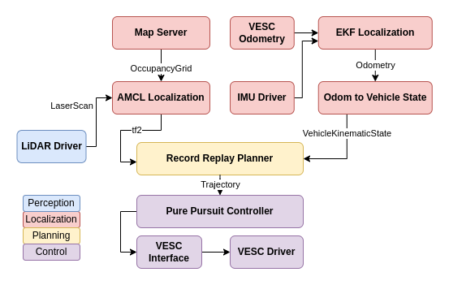

f1tenth_launch {#f1tenth_launch-package-design}
===========

This is the design document for the `f1tenth_launch` package.

# Purpose / Use cases

This package contains the launch configurations for running Autoware.Auto on a F1TENTH vehicle. Refer to the official [Autoware.Auto documentation](https://autowarefoundation.gitlab.io/autoware.auto/AutowareAuto/index.html) for the full instructions.

# Design

The package sources ROS2 community packages heavily for localization and mapping, as Autoware.Auto was originally intended for larger vehicles equipped with 3D LiDAR. NAV2 packages play a big role in the mapping and localization, which produce a transform tree and odometry for Autoware planning and control packages. The baseline architecture implemented in Autoware.Auto uses the record replay planner and pure pursuit controller.

# Future extensions / Unimplemented parts

The implementation of future architectures will be continued in [Autoware Universe](https://github.com/autowarefoundation/autoware.universe). Refer to the [presentation](https://docs.google.com/presentation/d/1kM3Lh19_CJLUD2G4gi9oLKoCsg3VMxY_vxXlJrO6Xkg/edit?usp=sharing) at IV2022 Autoware Workshop for more details.

